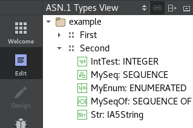
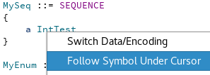
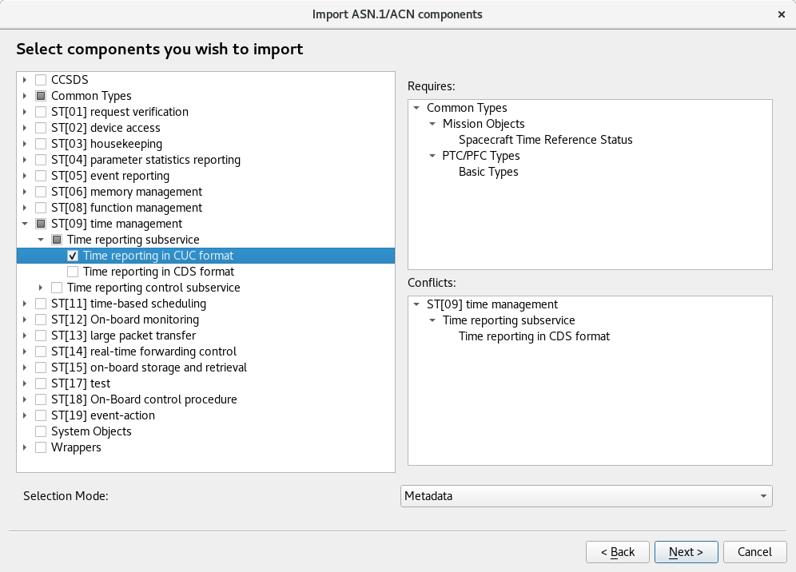

# Features
Plugin extends existing [Qt Creator's features](http://doc.qt.io/qtcreator/creator-quick-tour.html)
 to support ASN.1 and ACN files and models.

## Code highlighting
ASN.1 and ACN syntax is now highlighted in editor.

## Code completion
Code auto-completion (`{} ''` etc.) and basic completion suggestions are available for all ASN.1 and ACN files. 
Suggestions based on existing models require working ASN1SCC and files need to be in proper project.

## Code snippets
Code snippets can be used to speed up typing.

## Error highlighting
Errors reported by ASN1SCC are highlighted - both during typing and after compilation.

## New project type
QMake and CMake projects with ASN.1/ACN models can be created. During build ASN.1/ACN files included in the project are used to generate and compile C code.

## File outline
ASN.1 files included in the project can have proper Outline view displayed.

## ASN.1 Types View
All models included in the project can be displayed in this single view.

## Code navigation
User can easily switch between ASN.1 and ACN files (`F4` by default).
Type usage can also be easily followed to it's ASN.1 definition (`F2` by default).

## Model usages
All usages of a model in the project can be found (`Ctrl+Shift+U` by default).

## ASN.1 Components libraries
Models can be imported from ASN.1 components libraries. Users can define their own libraries.
Plugin is distributed with built-in [PUS-C library](https://github.com/n7space/asn1-pusc-lib).

*Import from ASN.1 components library...* entry is available in the project's popup menu and in *Tools* -> *ASN.1/ACN* menu entry.

## Additional targets (ICD)
QMake and CMake projects can be easily used to generate ICD (Interface Control Document) for defined project - build them with `icdFromAsn1` target, and ICD will be generated into `BUILDDIR\asn1sccGenerated\icd` folder.

ICD can be also generated using `Tools` menu, but adding additional build step is recomended as more convinient.
